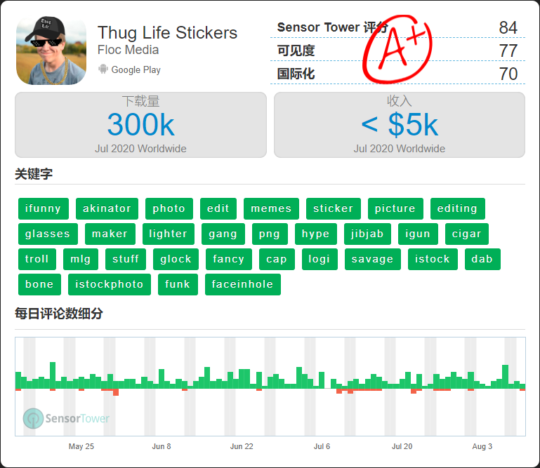

# 开源212点人脸关键点SDK实现Thug Life特效

## Thug Life是个什么梗?
HIPHOP亚文化的一种，可以把它理解成“屌炸天”的意思


给大佬们加Thug Life特效，装逼效果满分:

悔创阿里杰克马


一无所有王健林


不知妻美刘强东


## Thug Life APP

在Google Play找了一个Thug Life App查了下数据，总下载量500W+，月下载量30W，相当不错



### Google Play 地址
[https://play.google.com/store/apps/details?id=thug.life.photo.sticker.maker](https://play.google.com/store/apps/details?id=thug.life.photo.sticker.maker)

## 实现

### TengineKit
免费移动端实时人脸212关键点SDK。是一个易于集成的人脸检测和人脸关键点SDK。它可以在各种手机上以非常低的延迟运行。
<br>
https://github.com/OAID/TengineKit

### TengineKit 效果图


### 配置 Gradle

Project中的build.gradle添加

```java
    repositories {
        ...
        mavenCentral()
        ...
    }

    allprojects {
        repositories {
            ...
            mavenCentral()
            ...
        }
    }
```

主Module中的build.gradle添加

```java
    dependencies {
        ...
        implementation 'com.tengine.android:tenginekit:1.0.5'
        ...
    }
```

### 配置 manifests

```xml
    <uses-permission android:name="android.permission.ACCESS_NETWORK_STATE" />
    <uses-permission android:name="android.permission.INTERNET"/>

    <uses-permission android:name="android.permission.READ_EXTERNAL_STORAGE"/>
    <uses-permission android:name="android.permission.WRITE_EXTERNAL_STORAGE"/>
    <uses-permission android:name="android.permission.READ_PHONE_STATE"/>
```

### 处理Gif传过来的图片流

首先我们先初始化TengineKit:
1. 选用normal处理模式
2. 打开人脸检测和人脸关键点功能
3. 设置图片流格式为RGBA
4. 设置输入图片流的宽高，此处为图片的真实宽高
5. 设置输出图片流的宽高，此处也是图片的真实宽高
```java
    com.tenginekit.Face.init(getBaseContext(),
            AndroidConfig.create()
                    .setNormalMode()
                    .openFunc(AndroidConfig.Func.Detect)
                    .openFunc(AndroidConfig.Func.Landmark)
                    .setInputImageFormat(AndroidConfig.ImageFormat.RGBA)
                    .setInputImageSize(
                            showImage.getDrawable().getIntrinsicWidth(),
                            showImage.getDrawable().getIntrinsicHeight()
                    ).setOutputImageSize(
                            showImage.getDrawable().getIntrinsicWidth(),
                            showImage.getDrawable().getIntrinsicHeight()
                    )
    );
```

### 通过关键点得眼睛的中心点，嘴巴的点，下巴的点

```java
    Point getLeftEyeCenter(FaceLandmarkInfo fi){
        FaceLandmarkPoint p1 = fi.landmarks.get(105);
        FaceLandmarkPoint p2 = fi.landmarks.get(113);
        return new Point((int)((p1.X + p2.X) / 2), (int)((p1.Y + p2.Y) / 2));
    }

    Point getRightEyeCenter(FaceLandmarkInfo fi){
        FaceLandmarkPoint p1 = fi.landmarks.get(121);
        FaceLandmarkPoint p2 = fi.landmarks.get(129);
        return new Point((int)((p1.X + p2.X) / 2), (int)((p1.Y + p2.Y) / 2));
    }

    Point getMouthCenter(FaceLandmarkInfo fi){
        FaceLandmarkPoint p1 = fi.landmarks.get(208);
        return new Point((int)p1.X, (int)p1.Y);
    }

    Point getChinPoint(FaceLandmarkInfo fi){
        FaceLandmarkPoint p1 = fi.landmarks.get(53);
        return new Point((int)p1.X, (int)p1.Y);
    }
```

### 渲染

```java
    Face.FaceDetect faceDetect = com.tenginekit.Face.detect(girl);
    if(faceDetect.getFaceCount() > 0){
        faceLandmarks = faceDetect.landmark2d();
        if(faceLandmarks != null){
            for(int i = 0; i < faceLandmarks.size(); i++){
                Point leftEye = getLeftEyeCenter(faceLandmarks.get(i));
                Point rightEye = getRightEyeCenter(faceLandmarks.get(i));
                Point centerEye = new Point(
                        (leftEye.x + rightEye.x)/2,
                        (leftEye.y + rightEye.y)/2
                        );
                canvas.drawBitmap(
                        b_glasses,
                        centerEye.x - b_glasses.getWidth() / 2,
                        centerEye.y - b_glasses.getHeight() / 2,
                        null);

                Point mouthCenter = getMouthCenter(faceLandmarks.get(i));
                canvas.drawBitmap(
                        b_cigaret,
                        mouthCenter.x - b_cigaret.getWidth(),
                        mouthCenter.y,
                        null);

                Point thin = getChinPoint(faceLandmarks.get(i));
                canvas.drawBitmap(
                        b_decorate,
                        thin.x - b_decorate.getWidth() / 2,
                        thin.y + b_decorate.getHeight() / 3,
                        null);
            }
        }
    }
```

### 效果对比

原图|结果
:--:|:--:
 | 

## 参考

[TengineKit - Free, Fast, Easy, Real-Time FaceDetection & FaceLandmark SDK on Mobile.](https://github.com/OAID/TengineKit)